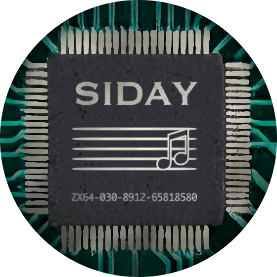

# siday

A player of chiptunes and tracker modules written entirely in Swift, in two forms: **a page that
plays in your browser**, and a command-line player for macOS. Both are the same emulators underneath:
of the sound chips of the ZX Spectrum, the Amstrad CPC, the Atari ST, the Commodore 64, the Amiga and
the PC's AdLib and Sound Blaster cards, and of the trackers that played modules on the Amiga and the PC.

The name is the two families of sound chip it began with, SID and AY. How to pronounce it is left open.

**In a browser:** open **[ptsochantaris.github.io/siday](https://ptsochantaris.github.io/siday/)** and
drop tunes or a whole folder on the page. Nothing is uploaded: they are played where they are. See
[In a browser](#in-a-browser).

**On the command line:** point it at files or folders. See [On the command line](#on-the-command-line).

```
siday ~/Music/chiptunes --shuffle
```

## What it plays

| Family | Formats |
|---|---|
| AY-3-8910 / YM2149 tracker modules | PT3, PT2, PT1, STC, STP, ASC, PSC, SQT, FTC, FXM, PSM, GTR, and TurboSound pairs |
| AY register recordings | VTX, YM (YM2, YM3, YM3b, YM5, YM6). A YM file from an Atari ST is played on the ST's chip, with the effects ST musicians made between one set of registers and the next (SID voices, digi-drums, sync-buzzer) |
| Atari ST sample tunes | the two kinds of YM file that are samples and not registers: digi-mixes (MIX1) and YM tracker tunes (YMT1, YMT2) |
| ZX Spectrum and Amstrad CPC program rips | AY (ZXAYEMUL), including beeper music |
| Atari ST and STE program rips | SNDH, packed with Ice or not: the sound chip with the timer effects ST musicians got out of it (SID voices, digi-drums, sync-buzzer), and the STE's samples |
| C64 | SID (PSID and RSID) |
| Amiga modules | MOD of four channels: ProTracker's, and those of the trackers it descends from and sat beside (Soundtracker's files of 15 samples, NoiseTracker, Startrekker), packed with PowerPacker or not. Played by ProTracker's own replayer on the Amiga's sound chip, in stereo |
| PC modules | XM, FastTracker 2's own format, and MOD files of more than four channels, played by FastTracker 2's replayer and mixer. S3M, Scream Tracker 3's format, played by Scream Tracker's replayer on either of its sound cards, the Gravis Ultrasound or the Sound Blaster Pro, with the AdLib card beside it for FM channels. IT, Impulse Tracker's format, played by Impulse Tracker's replayer, with its instruments, its many voices to a channel and its resonant filter |
| AdLib and Sound Blaster FM tunes | CMF, Creative's music files for the Sound Blaster, played by the driver that came with the card. ROL, the piano rolls of AdLib's Visual Composer, played by AdLib's sound driver, with the instruments of the bank beside the file or of the bank built into the player |

Not supported: RSID tunes that need the C64 BASIC ROM, and Compute!'s Sidplayer (MUS) data.
A few RSID tunes that depend on exact video or serial-port timing will not play correctly.
An SNDH tune that sends its notes out of the MIDI port has nothing to play here, and of some 5,900
SNDH files tried, a handful do not start; the reference player does not start them either.
A MOD file packed with XPK is not unpacked. An XM file written by a later tracker is played as
FastTracker 2 would play it, which is not always what the tracker that wrote it meant. An IT file
packed with MMCMP is not unpacked, and a sample that ModPlug Tracker packed its own way (ADPCM) is
silent. A ROL file that names an instrument no bank has is played with that instrument silent.

## In a browser

[ptsochantaris.github.io/siday](https://ptsochantaris.github.io/siday/) is the player as a web page,
and `Web/` is where it comes from. It is Swift too: the emulators and the page itself are compiled
to WebAssembly.

- Drop tunes or a whole folder on it, or choose them, and it plays them. Nothing is uploaded: the
  files are read where they are and never leave your computer.
- A tune with several songs lists them, by name where the file names them, and plays them in turn.
- A spectrum analyser follows what is being heard, and under it is a light for each voice of the
  tune, which glows as bright as that voice is loud.
- Press anywhere on the time bar to move there, in either direction.
- SID tunes know their lengths: those of the High Voltage SID Collection are built in.
- The list shows every tune that was added, however many, and can be searched. The cross at the end
  of a row takes that tune out of the list, and "Remove all" empties it.
- It has a volume of its own, apart from the computer's, which it remembers.
- One list chooses what a tune is heard through: mono, stereo (a module's own, or the AY chip's
  channels spread out, one way round or the other), or the speaker of an early-1980s television. It
  is remembered too.
- Small buttons in the player's corner put the spectrum analyser, the lights and the list of tunes
  away and bring them back, for as much or as little to look at as is wanted. That is remembered as
  well.
- A fourth of them brings out a picture to listen by: a lava lamp, a mirror ball, an aurora, or a
  pond. It is away until it is asked for.
- The keys are the command-line player's.

Press anywhere on the time bar to move to that place in the song; the pointer shows the time it is
over. A song is rendered to its end as soon as it starts, far faster than it plays, and the bar
shades in behind as it goes: anywhere in the shaded part is reached at once, and a place beyond it
as soon as the rendering gets there.

The lights are the lamps of an early-1980s tape recorder's recording level, one for each voice: an AY
chip's three channels (six for two chips), a SID's three voices, the Atari's three, each channel of a
module, each of the FM chip's nine voices. What a light shows is its voice by itself, measured where
the sound is made, before the voices are mixed: how far the voice swings, in decibels, over the last
fiftieth of a second. (A SID's voices are the exception: they go by their envelopes, since the chip
mixes them before there is anything to measure.) A module shows the channels its patterns use. Some
voices are ones a tune may never use, and get a light only once they are heard: the ZX Spectrum's
beeper, the samples a SID tune plays on the volume, the samples of an Atari STE; and since many
Spectrum tunes are for the beeper alone, an AY file's three channels too. Measuring costs nothing
that can be heard and little that can be timed: the sound is the same to the sample, and rendering
is slower by nothing for a SID tune, a thirtieth for a Spectrum's and at most a seventh for a module's,
which is rendered some hundreds of times faster than it plays.

The picture to listen by is for watching while a tune plays, and is made from what the tune's voices
are doing and not from the sound they add up to: how loud each is, the pitch it is at, and the notes
it starts, all of which the player knows because it is playing them. In the lava lamp each voice is a
blob of wax, which swells as the voice gets louder, floats higher the higher its note, and sinks back
into the pool when it falls silent. The mirror ball turns slowly at the top of a dark room and throws its
spots across the wall in rows. Each voice has a height on the wall of its own, and the colour of its
light is the note it is playing, the twelve notes of the octave being once round the colour wheel;
where two voices' lights fall together their colours add, towards white. In the aurora each voice is a
curtain of light drawn at the right of a night sky, higher for a higher note, that drifts away to the
left. The pond is water at night, seen from above: a note being struck is a drop falling into it, low
notes to the left and high ones to the right, and its rings spread and cross and come back off the
banks; a held note keeps the water trembling, and each voice leaves its colour in it. The water is
real in a small way, a grid of heights moved on by the rule that makes a wave. It is meant to be calm.
Nothing in it changes at once: a voice is followed a little behind, so the loudest note there is
brightens the picture over several frames and not in one; the kind of picture never changes of its
own accord; and its colours change when "shuffle colours" is pressed, over a few seconds, or, in all
but the aurora, by themselves and too slowly to see: once round the colour wheel in
five minutes or more. It can fill the screen (the button, or `f`), where its controls and the pointer go out of
sight when the pointer is left still. The picture is painted in Swift like everything else, a small
one of some 370 dots by 210 that the browser stretches, which is what makes it soft; a frame takes
about a millisecond.

The spectrum analyser and the lights are held back by as long as the browser says the sound takes to be heard, which
with wireless headphones is a sixth of a second or more. When the sound is sent somewhere else while
the page is open, headphones put on or taken off, the page makes its audio output afresh and carries
on from where it was. Adding `?timing` to the page's address shows what the browser is reporting.

Rendering ahead also finds the length of a tune whose file does not give one. Such a tune is allowed
three minutes; if it turns out to end sooner, the page shows its real length as soon as it is known,
and does not sit through the seconds of silence it takes to be sure a tune is over.

To run it from here:

```
./Web/serve.sh
```

That builds what needs building, serves the folder at http://localhost:8000 (to this Mac only) and
opens the page; Ctrl-C stops it. `./Web/build.sh` builds without serving. `./Web/publish.sh` builds
and puts the result on the web: it pushes the site, and nothing else, to the repository's `gh-pages`
branch, which GitHub Pages serves. The page on the web changes when that is run, and not before.

The folder is the whole site, static files and nothing more: an HTML page, a stylesheet, three short
JavaScript files, and what `build.sh` puts in `Web/generated`. Any web server can serve it (a browser
will not load it straight from disk). After a rebuild, reload the page.

Building it needs Swift 6.4 and the matching Embedded Swift SDK for WebAssembly (`swift sdk list` shows
what is installed), and nothing else: no Node, no packages to install. If Binaryen's `wasm-opt` is
installed (`brew install binaryen`), both modules go through it: the page's comes out a little over
half the size and the engine's a tenth smaller, a quarter and a twentieth once compressed. That is all
it buys. Measured on a SID, an AY, a tracker and an Atari ST tune, the engine renders no faster for it,
and what it renders is the same to the sample.

The modules are built to use WebAssembly's SIMD instructions (`-msimd128` in `Web/toolset.json`), which
makes rendering a quarter to a third faster and changes no sample of it. Every current browser has
them; Safari has since 16.4.

The page is two WebAssembly modules. `SidayWebAudio` is SidayKit and nothing else. It runs in a
worker (`engine.js`), which renders the whole of a song and keeps it (23 MB for each minute, for the
song that is playing), and the audio thread (`worklet.js`) only plays what it is sent, a fifth of a
second ahead: much the arrangement of the command-line player, so neither loading a tune nor anything
the page does can hold the sound up. What is kept is the sound as the chip made it; the television and
the spectrum analyser are applied as it is played, so a television can be put in the way or taken out at
any moment. Mono and stereo are what the chip makes, so a change between them renders the song again,
which takes a moment, and it goes on from where it was. `SidayWeb` is the page itself, written in
[ElementaryUI](https://elementary.codes). Between them is `siday.js`, for what only a browser has: the
chosen files and the audio graph. All told it is about 1.5 MB compressed, the song lengths of the High Voltage SID Collection being some 550 kB of that and the AdLib instruments some 120 kB.

With these in the package, a plain `swift build` with no `--product` also compiles the web targets and
what they depend on for the Mac, which takes minutes the first time and is of no use.

## On the command line

`siday` is the player for the terminal, on macOS 26 or later. To build it:

```
swift build -c release --product siday
```

The binary is `.build/out/Products/Release/siday` (`swift build -c release --show-bin-path` prints the folder).
Always use a release build: the emulators are far too slow in debug.

### Using it

```
siday <files or folders…>
```

Folders are searched recursively and files are recognised by extension. The files are only ever read.

While playing: `space` pause · `n` or `→` next · `p` or `←` previous · `+` / `-` (or `↑` / `↓`) subsong ·
`q` quit.

| Option | Effect |
|---|---|
| `--shuffle` | Random order |
| `--formats pt3,sid` | Only these formats |
| `--match text` | Only paths containing the text |
| `--loops n` | Passes through a looping tune before it fades (default 1) |
| `--fade seconds` | Fade-out for a tune that is still playing where it ends (default 20, and never longer than the tune itself) |
| `--default-time m:ss` | Time given to tunes whose length is unknown (default 3:00) |
| `--max-time m:ss` | Cap on any tune |
| `--subsong n` / `--all-subsongs` | Start at song n / play every song of multi-song files |
| `--chip ay\|ym`, `--clock Hz`, `--frame-rate Hz` | AY settings. Defaults: what the file says, otherwise an AY at 1773400 Hz and 50 Hz |
| `--output mono\|abc\|acb\|plastic\|wood` | What the tune is heard through. Mono by default, because many AY tunes layer the chip's three channels into one sound; `abc` and `acb` spread them left, centre and right (a SID has a single output, so for a SID tune these are mono, and a module has a stereo of its own, which these leave as it is); `plastic` and `wood` are the speaker of an early-1980s television (see below), which is mono too |
| `--s3m-card gus\|sb` | The sound card an S3M file is played on: a Gravis Ultrasound, or a Sound Blaster Pro with its eight bits at 22 kHz. Default: the one the file was saved with, where it says, and otherwise the GUS |
| `--amiga-separation 0…100` | How far apart a module's left and right are kept, in percent (default 20). 100 is the Amiga's own hard left and right, which is harsh in headphones |
| `--amiga a1200\|a500` | Which Amiga a module is heard on. The 1200 by default; the 500 has a low-pass filter at 4.4 kHz in the way, which is the darker sound much Amiga music was written on |
| `--sid-model auto\|6581\|8580` | SID model (default: what the tune asks for) |
| `--sid-engine residfp\|resid` | SID emulation. reSIDfp by default; reSID 1.0 is lighter, and its 6581 filter is drier |
| `--sid-filter-curve 0…1` | Where the 6581's filter sits, bright to dark (default 0.5). Real chips varied this much; reSIDfp only |
| `--songlengths path` | A copy of HVSC's `Songlengths.md5` to ask before the lengths that are built in; remembered for later runs. A file with no lengths in it is ignored |
| `--wav folder` | Render to WAV files instead of playing (existing files are not overwritten) |
| `--list` | Show what would be played, with format, length and title |
| `--check` | Load and render a few seconds of every file silently and report per format |
| `--bench` | Render at full speed and report the multiple of real time |

### How long a tune plays

- Tracker modules and register recordings play to their loop point (`--loops` times).
- AY files carry a length per song. Many give none, or the exactly three minutes that rips use as a
  stand-in; those songs are run silently for up to six minutes to find where they end or begin to repeat.
  If that finds neither, they get `--default-time`.
- SID tunes use the song lengths of the High Voltage SID Collection (HVSC). A SID file does not say how
  long its songs are, and most never end; the collection's team have timed every one. Their lengths
  for release 85, all 61,157 tunes, are built into the player, in the command line and the browser
  alike, and a tune is found among them by its content. A copy of the collection's own
  `Songlengths.md5` is asked first when there is one: named with `--songlengths` (once is enough), in
  `$SIDAY_SONGLENGTHS`, or found in a `DOCUMENTS` folder above the tune. That is the way to use a
  newer release's lengths, and it also finds a tune by its path inside HVSC when its content differs.
  A SID tune in neither gets `--default-time`.
- When a new release comes out, `swift Scripts/pack-songlengths.swift <its Songlengths.md5> <its
  number>` rebuilds the table in `Sources/SidayKit/SIDFile/SongLengthsData.swift`, and
  `SIDAY_SONGLENGTHS=<that file> swift test` checks every entry of it against the file.
- A CMF or ROL file ends where its music does, with a second after it for the last notes to die away.
- Only a tune that is still playing at that point is faded out, since it would go on repeating. One
  that has come to rest there has an ending of its own and simply stops. An AY file that asks for a
  particular fade gets that one.
- A tune that falls silent for five seconds is played on, unheard, to see whether the sound comes
  back. If it does within a minute, and before the tune is over, that was a pause, and it is played
  as it is written, however long: a tune made to go with a demo's pictures may wait half a minute
  between its parts. If it does not, the tune ends there. A tune that begins with ten seconds of
  silence is looked into the same way.
- Multi-song AY and SID files play the song the file names as its first; `+` and `-` move between songs.
- A module can hold several songs too: a game's music was often one file with a tune for every level,
  each ending in a jump back to its own start. Whatever the list of patterns holds that playing from
  its top never reaches is played from there as another song, and so on until nothing is left. A
  song is over when it comes round to where it has itself been. It may get there by way of a song
  found before it: another beginning for a tune goes on as the tune does. A piece that only leads
  into an earlier song is not counted unless it is half a minute long before it gets there, nor one
  with no note in it or shorter than a second; where the first song is such a nothing, the first
  real one is played.
  `+` and `-` move between them, and `--list --all-subsongs` shows how long each is. Some of what
  turns up is not a song but patterns the composer left behind after the end of the list.

### Through a television

These chips were written for and heard through a television: one small paper cone in a vented plastic
or wooden cabinet, fed by a sound stage with little treble to give. `--output plastic` and `--output wood` put that
between the chip and your speakers; in the browser the same two are in the list of outputs, and can
be switched while a tune plays, so the sound with and without can be compared. A television has one
loudspeaker, which is why it is a choice alongside mono and stereo and not on top of them.

| Stage | What it does |
|---|---|
| One speaker | The two channels are added together |
| Sound channel | Treble falls away gently from about 4.5 kHz |
| Amplifier and cone | Loud passages are bent slightly, adding a little second and third harmonic |
| Speaker | No bass below its own resonance (about 170 Hz in `plastic`, 90 Hz in `wood`), little above 6 to 7 kHz |
| Cabinet | A few resonances and a dip in between: the boxy low-middle and the forward upper-middle of a small set |

`plastic` is a small portable, thin and forward. `wood` is a large set in a veneered cabinet, fuller and
rounder. The level in the middle of the range is kept where it was. No particular set was measured: the
figures are typical ones, chosen to be judged by ear, and are all in one place
(`Sources/SidayKit/Core/Television.swift`).

### AY files ripped at the wrong speed

An AY file can only ask for its music routine once per 1/50 s. A few games drove their music from a
free-running loop instead, and their rips approximate that rate, not always well. Files known to be off
are corrected by content (`Sources/SidayKit/AYFile/AYFileCorrections.swift`) and show "timing corrected"
when they play; so far those are the Exolon 128K title tune, which the rip plays 14% fast, and the Kenny
Dalglish Soccer Match menu tune, which it plays 5% slow. Giving
`--frame-rate` plays any file exactly as written.

## How it is built

`Sources/SidayKit` holds all emulation. It has no dependencies and uses none of Foundation: it is
given a file's bytes and gives back samples, so it builds wherever Swift does, WebAssembly and Embedded
Swift included (see `Embedded/`). `Sources/siday` is the player for macOS: reading files, Core Audio
output, terminal keys and options (via swift-argument-parser).

| Part | Based on | Checked against |
|---|---|---|
| AY/YM chip | ayumi by Peter Sovietov (MIT) | C ayumi, sample for sample |
| Tracker players, VTX, YM | Ay_Emul by Sergey V. Bulba (`Players.pas`; free use with attribution) | ayfly's players (ay_emul_c11 for FTC, FXM, PSM, GTR), register frame by frame, over a whole collection |
| LH5 unpacking | ar002 by Haruhiko Okumura (public domain) | — |
| Z80 CPU | written for this project, after superzazu/z80 (MIT) | ZEXDOC and ZEXALL; cycle totals against the C core |
| AY file machine | Ay_Emul's port and interrupt rules; Patrik Rak's format | a z80ex-based reference, every port write and its T-state |
| 6510 CPU | written for this project | SingleStepTests/65x02: every opcode, every bus cycle |
| C64 environment | HVSC's SID file format document; driver and start-up state from libsidplayfp (GPL) | libsidplayfp's SID register writes |
| SID chip | reSIDfp from libsidplayfp 2.16.1 (GPL) | C++ reSIDfp on the same register traces, bit for bit |
| SID chip, `--sid-engine resid` | reSID 1.0 by Dag Lem (GPL) | C++ reSID on the same register traces, bit for bit |
| 68000 CPU | written for this project, from Motorola's manual | AtariAudio's (Musashi), through the tunes below |
| Atari ST machine, its sound chip, timers and STE samples | AtariAudio by Arnaud Carré (MIT); the chip's mixing table measured by Paulo Simões | AtariAudio itself, sample for sample: three minutes of each of 5,897 tunes, and every song of those with several |
| Atari ST YM files, their effects, digi-mixes and YM tracker tunes | AtariAudio | AtariAudio, sample for sample, on the 23 files to hand; no YM2 or YMT2 file among them |
| Ice unpacking | the C version by Hans Wessels (public domain) | — |

Where a reference player and Ay_Emul's source disagreed, the source was followed. Three deliberate
departures from Ay_Emul are marked in the code: old-format PSC modules start with version-correct sample
and ornament tables; an AY file only counts as Amstrad CPC once it writes a register through the CPC's
ports; and the AY player stub is placed after the file's memory blocks rather than before.


An Atari ST tune is the program that played it, so the machine is there to run it: a 68000, four
megabytes, the sound hardware, and the few things such a program asks of the operating system. It is
AtariAudio's design, and a light one. The tune's code is called and runs to its end in no time, once
for each tick of its player and once for each interrupt of a timer it has set going, and the timers
are moved on a sample of the output at a time. The sound chip here is not the one the Spectrum's tunes
use: the ST ties the chip's three outputs together, so their level is looked up in a table recorded
from the machine and not added up. One thing is done differently from AtariAudio, and only on the way
out: the chip's 250,000 steps a second come down to the output's rate through a low-pass filter and
not a plain average, which keeps out tones that were never played. `siday --raw file.raw tune.sndh`
writes the plain average, which is what agrees with AtariAudio to the sample.

A module is played as ProTracker played it. The replayer is ProTracker 2.3D's, by way of pt2-clone's
port of it to C, and keeps ProTracker's mistakes, because tunes were written by ear against them. What
it would have told the Amiga's sound chip it tells an emulation of that chip, Paula: four voices
reading eight-bit samples out of memory, each at a rate of its own. Paula is run at 96,000 samples a
second, with each step in her output replaced by one that holds nothing above the range of hearing,
then through the filters the Amiga has on its way to the socket, and then halved. Two of the voices
are wired to the left and two to the right with nothing in between. Through loudspeakers a room mixes
the two; in headphones nothing does, and it is harsh. So a module in stereo (`--output abc` or `acb`,
which are the same thing to a module) has its two sides brought most of the way together, to a fifth
of the Amiga's separation, which is what pt2-clone does unless told otherwise;
`--amiga-separation 100` gives the Amiga's own, and mono or a television brings them together entirely. Files from other trackers of the family have the few effects they meant differently turned
into ProTracker's as they are read. One effect is left out, as it is in pt2-clone: E8x, which filters
a sample in place, because nearly every module that has it means something else by it. A tune ends
where it would play a row it has played before. `siday --raw file.raw tune.mod` writes the tune as
pt2-clone writes one to a file, sixteen bits with its dither, and the two agree to the sample.

An XM file, and a MOD file of more channels than the Amiga has, is played as FastTracker 2 played
it: the replayer and the mixer are FastTracker 2.09's, by way of ft2play's port of them to C. The mixer
works in whole numbers, with FastTracker's interpolation between one sample and the next and its
ramping of volumes, both switched on as they were when the tracker was new, and it places each
instrument between the speakers where the module says. FastTracker itself reads no more than 32
channels and only an even number; files from later trackers have any number, and are played the same
way. A tune ends where it would play a row it has played before. `siday --raw file.raw tune.xm` writes
what ft2play writes to a file, and the two agree to the sample.

An S3M file is played as Scream Tracker 3 played it, and that depended on the sound card. With a
Gravis Ultrasound the card did the mixing: the tracker told it, a tick at a time, what each voice was
to play, and the card played them smoothly, each in its place between the speakers, sliding from one
volume to the next. With a Sound Blaster Pro the tracker mixed for itself, into eight bits, with no
smoothing, at 22 kHz in stereo with eight channels hard to each side. Both are here, by way of
st3play's port of the tracker and its emulation of the cards. A file that Scream Tracker saved says
which card it was saved with, and is played on that one; any other is played on the GUS, and
`--s3m-card` asks for either. Scream Tracker's samples were eight bits and no longer than 64,000
bytes; files from later trackers have sixteen-bit and longer ones, which are played as they stand,
and samples tuned higher than Scream Tracker had room to write down, which are played at the pitch
they say and not at the highest Scream Tracker could have given them.
`siday --raw file.raw tune.s3m` writes what st3play writes to a file. The two agree to the sample when
the environment variable `SIDAY_REFERENCE_SLIPS` is set, which repeats one slip of st3play's that
Scream Tracker did not make: it loses the sign of a number on very high notes, and plays them wrong.

Nine of Scream Tracker's channels were not samples at all but voices of an AdLib card, the FM
synthesiser most PCs had before they had anything better, and there are S3M files that use them,
most of those with no samples at all. Scream Tracker's driver for the card is ported with the rest of it, and the
card's chip is an emulation of the Yamaha OPL3, a port of Nuked OPL3, which was worked out from the
chip's own ROMs and circuits. The OPL3 is the chip of the later Sound Blasters, and plays what was
written for the AdLib's own OPL2 as that did; it is here whole, with its drums, its four-operator
voices and its second set of registers, none of which Scream Tracker used. st3play has an OPL2 of
its own, so for these files the check is in two parts: the chip against Nuked OPL3 itself on streams
of register writes, and the tune against st3play with Nuked OPL3 put in place of its chip. Both agree
to the sample. Writes reach the chip no faster than a PC could make them, two samples apart, so that
a note let go and struck again in one tick is heard to be. The samples of a tune with FM in it are as
loud as in any other tune: st3play turns them down by a third at the card's first note, to leave room
for it.

An IT file is played as Impulse Tracker 2 played it, by way of it2play's port of its replayer: 64
channels, each of which can have many notes sounding at once, since an instrument says what becomes
of its note when the next one comes (cut, left to play on, released or faded), up to 256 voices in
all; envelopes for volume, place and pitch; and a resonant low-pass filter worked by an envelope or
by the Zxx effect. Pitch slides are worked out in whole numbers, as Impulse Tracker did before its
last version, which few people had. The sound is not from one of Impulse Tracker's own drivers,
which were written for the sound cards of the 1990s and cannot play a stereo sample, but from the
driver it2play adds to them: it mixes in floating point, reads samples through an eight-point
windowed sinc, ramps volumes so that notes do not click, and gives the filter the wider range
ModPlug Tracker gave it where a file asks for that. Compressed samples are unpacked.
`siday --raw file.raw tune.it` writes what it2play writes to a file, and the two agree to the sample.
Impulse Tracker has room for 100 samples, 100 instruments and 200 patterns, and it2play refuses a
file with more. Later trackers wrote such files, and they are played: up to 253 samples, 254
instruments and 254 patterns, which is as many as the format's single bytes can number. (Impulse
Tracker uses the numbers just past its hundredth sample to mean a note sent out by MIDI; for a file
with more samples those meanings are moved to the top of the range.) There is no reference to check
these against, since it2play does not play them.

Four other things are done differently. The filters start open, as they do in Impulse Tracker's drivers:
it2play leaves it to a line of the tracker's MIDI settings to open them, and a file that brings
settings of its own with that line blank is played with every filter shut, muffled from end to end
(the environment variable `SIDAY_REFERENCE_SLIPS` repeats that, for comparing the two). A sample that
is said to begin at the very end of the file has no sound, where it2play gives up on the whole file:
that is how ModPlug Tracker wrote an empty sample, in one file of twenty-five. A sample whose own
vibrato has the "ramp up" wave, which OpenMPT added and Impulse Tracker has not got, gets that wave,
where it2play reads past the end of its three. And where it2play would read sound from outside a
sample, which a few files lead it to do, there is silence. The filter is the one place where the web
player and the Mac's do not agree to the last bit: each asks its own maths library for a power of two.

A CMF file is a tune for the FM chip alone: its instruments, each the handful of numbers the chip
wants for one, and the music as MIDI. It was Creative's format, and what played it was SBFMDRV,
the driver on the disk that came with a Sound Blaster. That driver is what is here, by way of fmdrv's
port of it to C, and it is a small and particular MIDI player: nine voices, or six and the chip's five
drums when the tune asks for them; a key's speed worked into the instrument's own level; four
controllers of its own, one of them to move a channel's pitch by fractions of a semitone; and no
bending of pitch as MIDI has it, which it passes over. What it did oddly is done oddly here, since the
tunes were written to how it sounded. The tune's clock is the PC's timer, and the timer and the chip
ran off the one crystal, so a tick is a whole number of twenty-fourths of one of the chip's samples
and the two are kept in step exactly. `siday --raw file.raw tune.cmf` writes the chip's own samples,
at its own 49,716 a second, and they agree to the sample with fmdrv playing on Nuked OPL3: on all
932 files to hand, from end to end.

A ROL file is a piano roll from AdLib's Visual Composer, the program that came with the AdLib card:
nine voices, or six and the drums, each a list of notes and, beside it, the times at which its
instrument, its volume and its pitch change. It is played by AdLib's own sound driver, as AdPlug has
it from the code AdLib gave programmers. A ROL file holds no sounds. It names its instruments, eight
letters at most, and the sounds were in a bank file beside it: `STANDARD.BNK`, which came with the
program and which people added to and passed on, or a bank of the tune's own. So an instrument is
looked for in three places, and the first to have it wins:

1. a bank with the tune's name beside it (`TUNE.BNK` for `TUNE.ROL`);
2. `STANDARD.BNK` beside it;
3. the bank built into the player.

The built-in bank is what lets a ROL file be played by itself, and it is all the browser has to go
on. It has 9,683 instruments: AdLib's own 145; some 1,200 more from a dozen enlarged banks that
travelled with collections of ROL files; and the rest from the bank of IMPlay, a later player of the
same kind of music, for the sake of the names. Banks do not always agree about a name. Where they
differ, AdLib's bank has it, and after that the sound that most banks give it.
`swift Scripts/pack-bank.swift` makes the table from bank files. Of 1,509 ROL files tried, 1,479 find
every instrument there and 30 are left with one, two or three that no bank to hand has, which are
silent; the tune's detail says how many. `siday --raw file.raw tune.rol` writes the chip's own
samples, as for a CMF file, and they agree to the sample with AdPlug's ROL player on Nuked OPL3 given
the same bank, on every one of those files. (AdPlug refuses a ROL file that has no bank beside it,
and wants one bank to have everything.) A beat is played as sixty ticks at most however many the file
gives it, as AdLib's driver had it, and tunes with more were written to that.

Both are heard as the card put them out: one channel, through the filter on the card's board that
kept its output centred, and brought from the chip's rate to the player's through a windowed sinc.

A YM file is played one of two ways. One recorded on an Atari ST goes to the ST's chip and timers
(`STYMRenderer`): that is every YM2 and YM3, which are the ST's by definition, and a YM5 or YM6 that
gives the ST's clock of 2 MHz or uses the effects. Any other is a plain recording of an AY or YM chip
on some other machine and is played like a VTX, with the stereo choices that go with that. Asking for
a chip, a clock or a frame rate by name (`--chip`, `--clock`, `--frame-rate`) gets the plain recording
whatever the file is.

Tracker players keep the field names and control flow of the Pascal they came from, so the two can be
read side by side. Tracker modules are loaded into a 64 KB wrap-around memory and all file parsing is
bounds-checked, so a corrupt file plays wrongly or is skipped but does not crash the player.

## Licence and credits

GNU General Public License, version 2 or (at your option) any later version; see `LICENSE`. One part,
the driver for CMF files, comes from work under the Apache License 2.0, which goes with version 3 of
the GPL and not with version 2: the player as a whole is passed on under version 3 or later.

This project stands on other people's work, most of all Sergey Bulba's Ay_Emul, Dag Lem's reSID,
libsidplayfp and its reSIDfp (Leandro Nini, Antti Lankila, Simon White, Dag Lem), Peter Sovietov's ayumi
and Arnaud Carré's AtariAudio.
`THIRD-PARTY.md` lists what came from where and under which terms.

What it is made from:

- [Ay_Emul](http://ay.strangled.net/) by Sergey Bulba: the tracker players, the VTX and YM handling
  and the rules of the AY file machine are ported from its source. The `.ay` format is as he and
  Patrik Rak describe it.
- [libsidplayfp](https://github.com/libsidplayfp/libsidplayfp) and its reSIDfp, by Leandro Nini, Antti
  Lankila, Simon White and Dag Lem: the SID chip, and the way a C64 is started for a tune.
- [reSID](https://github.com/libsidplayfp/resid) by Dag Lem: the other SID chip (`--sid-engine resid`).
- [ayumi](https://github.com/true-grue/ayumi) by Peter Sovietov: the AY and YM chip.
- [AtariAudio](https://github.com/arnaud-carre/AtariAudio) by Arnaud Carré (Leonard of Oxygene): the
  Atari ST as a tune needs it, with its sound chip, its timers and the STE's samples, and the playing
  of YM files as the ST played them. The YM format is his too. The table of
  how the ST mixes its chip's three channels was measured on the machine by Paulo Simões. The SNDH
  format is the work of the [SNDH archive](https://sndh.atari.org/) and those who keep it.
- [pt2-clone](https://github.com/8bitbubsy/pt2-clone) by Olav Sørensen (8bitbubsy): the Amiga as a
  module needs it. The replayer is his C port of ProTracker 2.3D's, and Paula, her filters and the
  reading of modules are his too; the band-limited steps in Paula's output are by aciddose. ProTracker
  itself is by Lars Hamre, Anders Hamre, Sven Vahsen and Rune Johnsrud, after Karsten Obarski's
  Ultimate Soundtracker, where the module began.
- [ft2play](https://github.com/8bitbubsy/ft2play), also by Olav Sørensen: FastTracker 2's replayer
  and mixer, ported by him from the tracker's own assembly and Pascal. FastTracker 2 is by Fredrik
  Huss and Magnus Högdahl, of Triton.
- [st3play](https://github.com/8bitbubsy/st3play), also by Olav Sørensen: Scream Tracker 3's replayer,
  its Gravis Ultrasound driver, Sound Blaster mixing and AdLib driver, and the emulation of the GUS's
  sound chip. Scream Tracker 3 is by Sami Tammilehto (Psi) of Future Crew.
- [it2play](https://github.com/8bitbubsy/it2play), also by Olav Sørensen: Impulse Tracker 2's
  replayer, ported by him from the tracker's own assembly, the reading of IT files, and the sound
  driver, which is his own. Impulse Tracker is by Jeffrey Lim.
- [Nuked OPL3](https://github.com/nukeykt/Nuked-OPL3) by Nuke.YKT: the Yamaha OPL3, the FM chip of
  the AdLib and Sound Blaster cards, as exact as its author could make it from the chip itself. The
  chip's ROMs were read out by Matthew Gambrell and Olli Niemitalo.
- [fmdrv](https://github.com/viiri/fmdrv) by Sergei "x0r" Kolzun: SBFMDRV, the driver that played CMF
  files on a Sound Blaster, ported by him to C from the driver itself. The driver and the CMF format
  are Creative's.
- [AdPlug](https://github.com/adplug/adplug) by Simon Peter and others: its player of ROL files, by
  OPLx, and AdLib's sound driver as OPLx, Stas'M and Jepael have it there from the code AdLib gave
  programmers. Visual Composer, the ROL format and the first bank of instruments are AdLib's; the
  instruments built into the player are theirs and those of the many people who added to that bank.
- The Ice 2.4 unpacker is after the C version Hans Wessels placed in the public domain; Ice itself is
  by Axe of Delight.
- [z80](https://github.com/superzazu/z80) by superzazu: the Z80's cycle counts.
- ar002 by Haruhiko Okumura: the unpacking of LH5, which VTX and YM files are packed with.
- The [High Voltage SID Collection](https://www.hvsc.c64.org/): the length of every song of every SID
  tune, which its team have timed and which are built into the player, and the description of the SID
  file format.

What it was checked against, besides the originals of the above:

- [ayfly](https://github.com/l29ah/ayfly) and [ay_emul_c11](https://github.com/pdxiv/ay_emul_c11), for
  the tracker players.
- [z80ex](https://github.com/lipro/z80ex), and the
  [ZEXDOC and ZEXALL](https://mdfs.net/Software/Z80/Exerciser/) instruction exercisers by Frank
  Cringle, for the Z80 and the AY file machine.
- [SingleStepTests/65x02](https://github.com/SingleStepTests/65x02), for the 6510.

What it is built with: [swift-argument-parser](https://github.com/apple/swift-argument-parser) for the
command line, and [ElementaryUI](https://elementary.codes) and
[JavaScriptKit](https://github.com/swiftwasm/JavaScriptKit) for the page in the browser.
